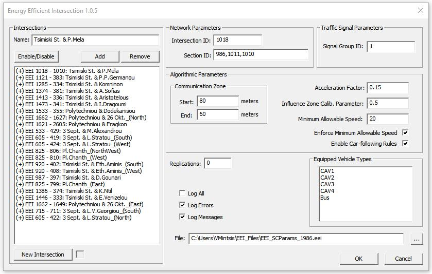
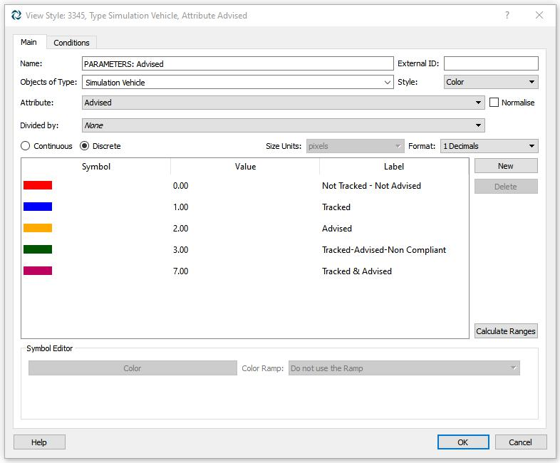
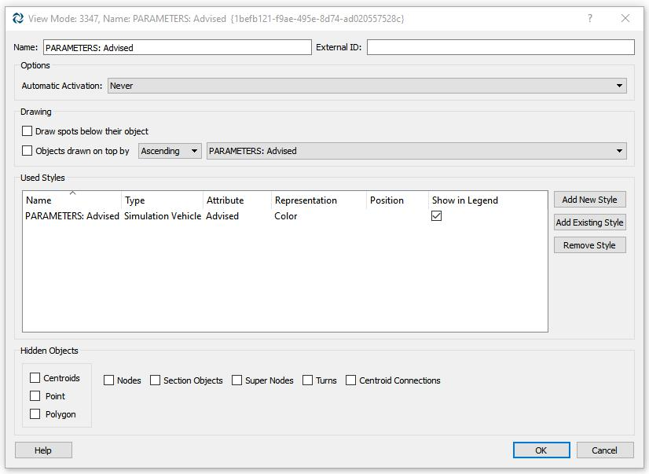

# Enhanced Velocity Planning Algorithm (EVPA)

EVPA is an API that enables the emulation of dynamic eco-driving near signalized intersections in the microscopic traffic simulator [Aimsun](https://www.aimsun.com/aimsun-next/).

# Build DLL

An Aimsun Next installation package is necessary for building the EVPA DLL.

Instructions on how to build an Aimsun API can be found in the Aimsun Next Users Manual.

Additionally the following header and library files (available in an Aimsun Next installation package) should be included in the EVPA project:

- AAPI_Util.h, AKIProxie.h, ANGConProxie.h, and CIProxie.h should be added in the [include](https://github.com/vmintsis/enhanced-velocity-planning-algorithm/tree/main/include/Aimsun64) folder
- angext.lib, and angextcontrol.lib should be added in the [lib](https://github.com/vmintsis/enhanced-velocity-planning-algorithm/tree/main/lib/Aimsun64) folder

# Documentation

Insturctions on how to add an Aimsun API in [Aimsun](https://www.aimsun.com/aimsun-next/) can be found in the Aimsun Next Users Manual.

## EVPA GUI

The following figure depicts the EVPA GUI that pops up when an Aimsun Experiment is run and the EVPA API is enabled:

The EVPA GUI allows a user to initialize and manipulate the following elements of the EVPA API:

- add/remove an intersection approach where dynamic eco-driving is implemented
- enable/disable the dynamic eco-driving service along selected intersection approaches
- specify the road sections that constitute an intersection approach (from farthest to closest)
- specify the intersection that the coded intersection approach leads to
- specify the signal group for which speed advice is estimated
- specify the zone upstream of the intersection where speed advice execution starts
- specify algorithmic parameters of dynamic eco-driving
- specify vehicle types that receive and execute speed advice
- specify number of replications for which EVPA API will be run automatically
- specify log files that will be output
- upload text file that contains the aforementioned information

**_NOTE:_** To explicitly emulate manually driven connected vehicles (i.e. adaptation rate to speed advice varies per driver) a vehicle type named NC_Car needs to be specified in [Aimsun](https://www.aimsun.com/aimsun-next/).

## View Style/Mode

In order to visualize vehicle types based on speed advice implementation the following View Style and Mode need to be specified in [Aimsun](https://www.aimsun.com/aimsun-next/).

# Technical questions

If you have a bug, please report it.

# Getting involved

We welcome your contributions.

- Please report bugs and improvements by submitting [GitHub issue](https://github.com/vmintsis/enhanced-velocity-planning-algorithm/issues).
- Submit your contributions using [pull requests](https://github.com/vmintsis/enhanced-velocity-planning-algorithm/pulls).

# Citing EVPA

If you use EVPA for academic research, you are highly encouraged to cite our paper:

E. Mintsis, E.I. Vlahogianni, E. Mitsakis, S. Ozkul, (2021). Enhanced speed advice for connected vehicles in the proximity of signalized intersections. European Transport Research Review 13(2). [Online]. Available: https://doi.org/10.1186/s12544-020-00458-y